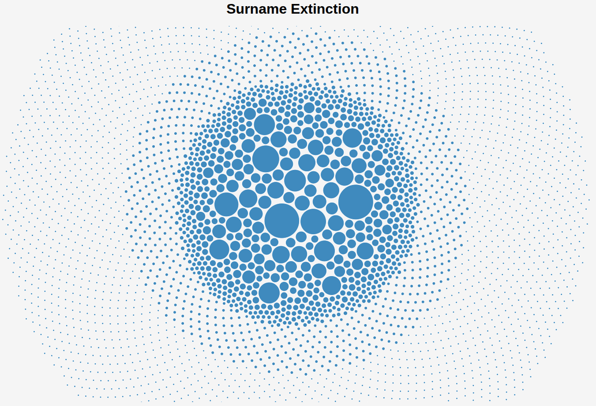
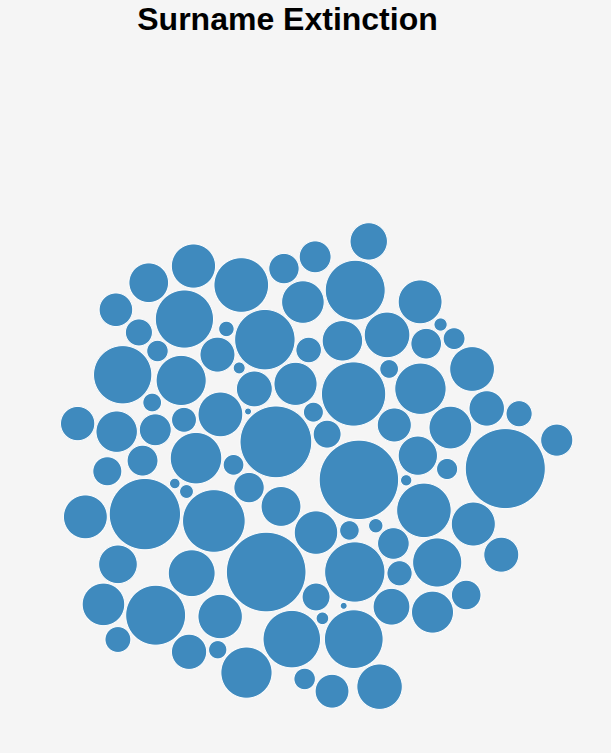
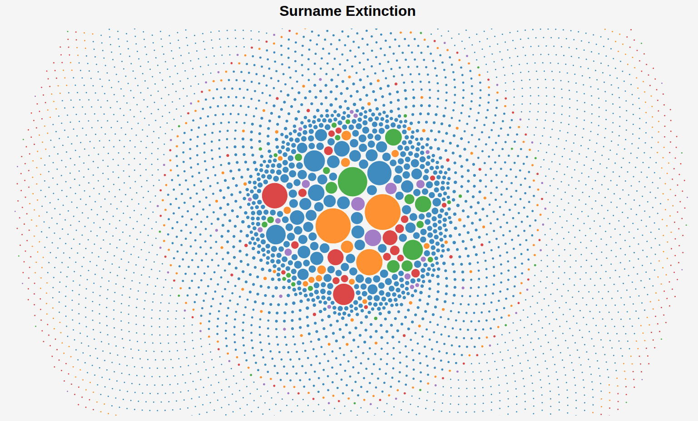
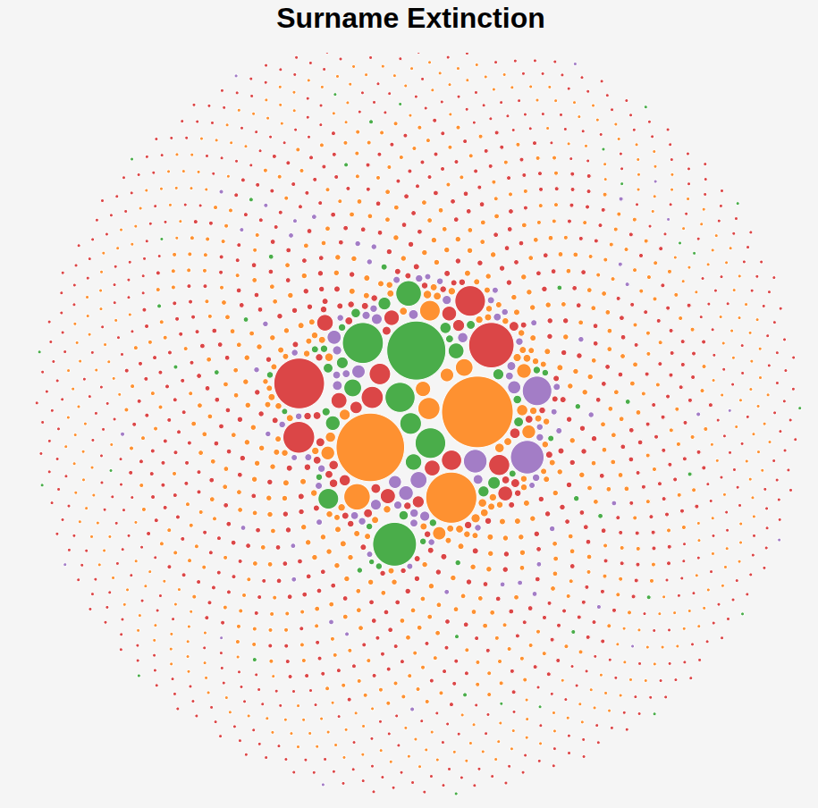

# 🌳 Surname Extinction Simulator

<div align="center">
  
  
  <br/>
  <em>Control Simulation (Native English surnames only)</em>
</div>

<div align="center">
  
  
  <br/>
  <em>Simulation with Immigration</em>
</div>

---

## 🧠 About

**Surname Extinction Simulator** is an animated, data-driven simulation of surname survival across generations. It explores how demographic, and stochastic factors influence the propagation or extinction of family names over time.

Inspired by real population genetics and surname frequency distributions, this project combines:
- 💻 A Python backend to simulate population dynamics
- 📊 D3.js-based animated front-end to visualize surname propagation
- 🧬 A model that evolves based on inheritance, reproduction, and (optionally) immigration

---

## ✨ Features

- 🎥 **Animated generational bubble chart** of surname populations
- 📈 Real-time charts of total population and surname diversity
- 👨🏻 Base dataset includes actual English surname frequencies
- 🌍 Optional **immigration logic** to simulate surname inflow from other cultures
- 📁 Generation-by-generation `.csv` output for custom analysis
- ⚙️ Customisable parameters (starting population, children per couple, etc.)

---

## 🎯 Objectives & Considerations

This project explores:
- **Surname extinction** under demographic drift
- The effect of **immigration** on cultural surname diversity
- Long-term surname survival without explicit selection pressures

Special care was taken to:
- Correctly simulate child inheritance **without resampling bias**
- Ensure population stability over generations with statistically balanced reproduction
- Maintain a clean visualisation loop with true generational transitions
- Track **cumulative and per-generation surname counts** for insights

Downfall of the model:
- Serious resampling bias due to population correction function in the control
- Asymmetry in national vs global surnames due to lack of availability of surname datasets
- Oversimplification of breeding patterns (consistent immigration ratio, ignorance of cultural influences etc.)

---

## 📹 Demo Videos
<!-- 
> 🧪 Click to view simulations in action:

[](https://www.youtube.com/watch?v=YOUR_CONTROL_SIMULATION_LINK)  
*[Native English-only Simulation]*

[](https://www.youtube.com/watch?v=YOUR_IMMIGRATION_SIMULATION_LINK)  
*[Simulation with Immigration Enabled]* -->

---

## 🛠️ How It Works

- Python script generates synthetic generations based on real surname frequencies.
- Offspring inherit their father's surname, with child count drawn from a Poisson distribution.
- Every generation is saved to `.csv`, and optionally plotted live via matplotlib.
- The D3.js frontend animates transitions from generation to generation using color-coded nationality bubbles.

---

## 🚀 Running the Project

1. 🔧 Install dependencies:
   ```bash
   pip install matplotlib numpy
   ```

2. 🧬 Generate simulation data:
   ```bash
   python surname_simulation.py
   ```

3. 🌐 Visualise it:
   ```bash
   cd surname-visualisations
   python3 -m http.server
   ```

4. Open your browser at [http://localhost:8000](http://localhost:8000)

---

## 📂 File Structure

```bash
.
├── surname_simulation.py       # Core Python simulation
├── surnames_sorted.csv         # Real surname frequency input
├── surname-visualisations/
│   ├── index.html              # Visualisation page
│   ├── script.js               # D3.js logic
│   └── generations/            # Generated per-gen CSVs
├── logs/                       # Summary statistics per generation
├── media/                     # Screenshots for README
```

---

## 📚 Potential Developments

- Age structure and mortality modelling
- Selection factors (E.G. same nationality preference)
- Migration dynamics between multiple regions
- More accurate surname distributions
- Export to animated `.mp4` videos
- Surname concatenation

---

## 📖 License

This project is open-source and free to use commercially